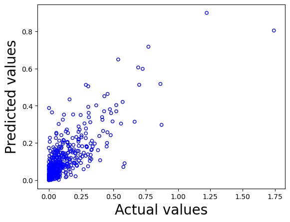

# How-can-we-predict-the-success-of-a-movie-Predictive-Data-Analysis-
“How can we predict the success of a movie?” Our main goal with this project is to study different methods that can efficiently predict if a certain movie will be a success, based on its features. 

## Data description and research question

In this project, we will study how different deep and machine learning algorithms can be used to predict, analyse and retrieve useful information from a particular dataset while using exploratory data analysis methods to preprocess and clean the data. Different models will be further evaluated and compared, in order to understand which ones are more efficient and why.
To proceed with our project, we chose a dataset that can be accessed at https://github.com/cla-cif/movie-DB-2000s (as part of Kaggle's "The Movies Dataset" available at https://www.kaggle.com/datasets/rounakbanik/the-movies-dataset). This "the 2000s Movie Database" dataset can be described as a film dataset that contains movies released since the year 2000 to 2009.

The data dictionary shown below presents each variable along with its respective description and domain:

| Name               | Description                                                                 | Domain     |
|--------------------|-----------------------------------------------------------------------------|------------|
| Title              | Name of the movie                                                           | Nominal |
| Year               | Year the movie was released                                                 | Integer |
| Genres             | Genre of the movie                                                          | Nominal |
| Language           | Language spoken in the movie                                                | Nominal |
| Country            | Country responsible for the making of the movie                            | Nominal |
| Content_Rating     | Classification of the movie regarding the suitable demographic             | Nominal |
| Duration           | Length of the movie                                                         | Integer |
| Aspect_Ratio       | Describes the dimensions of the screen                                      | Float |
| Budget             | The cost required to make the movie                                         | Integer |
| Gross_Earnings     | The total revenue generated by the movie                                    | Integer |
| Director           | The director of the movie                                                   | Nominal |
| Actor1             | First actor of the movie cast                                               | Nominal |
| Actor2             | Second actor in the movie cast                                              | Nominal |
| Actor3             | Third actor in the movie cast                                               | Nominal |
| Reviews_by_Users   | The number of reviews by users                                              | Integer |
| Reviews_by_Critics | The number of reviews by critics                                            | Integer |
| IMDB_Score         | The IMDB score obtained by the movie                                        | Float |

## Exploratory data analysis

The EDA was performed so we could better understand how variables were related to each other, which would be essential to decide which of the variables would then be used as input and output for the tested machine and deep learning models.

Our research question focuses on studying the success of a movie, so we decided that variables such as “Gross_Earnings” and “IMDB_Score” would be the most suitable ones to consider as the output variable for the models, as both these variables represent an outcome or result measurement to assess the movie’s success.

we concluded that our model should have no more than 4 input variables, to avoid making it over complex and overfitting. So we chose our input variables based on their relation with the model’s output variable “Gross_Earnings”, prioritising the variables that presented a stronger and more meaningful relation with this one. Variables such as “Duration”, “Budget”, “Reviews_by_Users” and “IMDB_Score” were the ones we believed to be more suitable for the model’s input.

## Machine learning prediction

The Decision Tree model developed was trained with the rpart(), while also using the “anova” method for the regression. It’s important to note that no tree pruning was performed. The following results were produced:

The SVM model developed was trained with the ksvm() function, where the cost function was set to 1, as we found that it often produced better results.

The neural network models were trained using the neuralnet() function. We found that the best learning rate to use for this neural network (based on the root-mean-square error (RMSE)) would be 0.01. We first chose to test a model “NN_3” with 1 hidden layer and 3 neurons, with a learning rate of 0.01.

We also used and trained other neural network configurations such as one model “NN_44” with two hidden layers with 4 neurons each and another model “NN_4” with one hidden layer with 4 neurons.

## Deep learning prediction

To build our deep learning prediction models, we focused on using methods such as the Deep Artificial Neural Network (DANN) and the Convolutional Neural Network (CNN).

The DANN model built used 3 fully connected (dense) layers, as the first layer (input layer) is composed of 5 neurons while expecting 4 input features (4 input variables that we previously chose). The second layer contains 5 neurons and the output layer (final) presents only one neuron meant for the output “Gross_Earnings” feature. Not many neurons were used in the construction of this model as we did not want it to become over complex or overfitting. This model used the activation function “ReLU” for all the first two layers, as this function introduces non-linearity to the network (which helps to deal with more complex relations), being computationally efficient and we expect output values higher than 0 while using the mean squared error (MSE) as its loss function. The learning rate was set to 0.06, as we found that values below 0.01 often did not produce good results, along with an SGD optimizer.

The ANN model used 1 dense (fully connected) layer, presenting 1 neuron as output, while expecting 4 features as input. The learning rate used was quite similar to the previous one, 0.01, along with the same SGD optimizer. This model also uses MSE as its loss function. On the other hand, there is no use of an activation function.

The first and simpler CNN model tested used a “LeNet” architecture with 6 layers, as the first convolutional layer (input layer) expects an input shape of (4,1,1) and is composed of 3 filters of size (2,1). The second convolutional layer contains 10 filters of size (2,1). For both these convolutional layers, the stride is (1,1) and the padding used ensures that the output size of the image is the same as the input. The third layer is a flattening layer, as it flattens the output of the previous layer into a 1D array. The fourth and fifth layers are both fully connected layers that contain 120 and 84 neurons, respectively. The final output layer contains only one neuron meant for the output variable. This model used the activation function “ReLU” for all the convolutional and hidden layers. Similarly to the other models, this one also has the same SGD optimizer and MSE as its loss function. We decided not to add a pooling layer after the first convolutional layer as the dimensions can be considered too small to be further reduced (this would impede the feasibility of incorporating another convolutional layer with a kernel size larger than (1,1)). It’s also worth mentioning that normally the kernel size is represented by odd numbers, we used a size of (2,1) as we believed that we would get less meaningful information with a size of (3,1).

To further investigate the CNN architecture, we tested another, more complex, CNN model. This model used an “AlexNet” architecture with 8 layers, as the first convolutional layer (input) expects an input shape of (4,1,1) and is composed of 12 filters of size (3,1). The second layer is a max pooling layer, used to decrease the spatial dimensions of the feature map, with both a pooling size and stride of (2,1) (the same size is used to prevent a possible overlap), followed by two convolutional layers with stride (1,1) and a number of 48 and 32 filters, respectively, for hierarchical feature learning purposes. The next layer is a flattening layer, while the sixth and seventh are both fully connected dense layers that contain 150 and 100 neurons, respectively. The final output layer presents only one neuron. This model used the activation function “ReLU” for all the convolutional and hidden layers, as well as the previously mentioned SGD optimizer and MSE as its loss function.

## Performance evaluation and comparison of methods

The results obtained and previously seen by each model were then evaluated performance wise and compared. It’s important to mention that the same training and testing sets were used for all the models, with a 70/30 split. We decided to use the same normalisation method, min-max scaling, for an easier comparison between results obtained in different models. For all the deep learning methods used the number of epochs and batch size were the same, 100 and 64, respectively.

The following table shows how the models used performed based on the root mean square error (RMSE) and the R-squared value of the regression calculated.

| Model     | RMSE   | R-squared (%) |
|-----------|--------|----------------|
| Decision Tree | 0.1729 | 53.15          |
| NN_3      | 0.0536 | 66.56          |
| NN_44     | 0.1616 | 51.25          |
| NN_4      | 0.1242 | 56.31          |
| SVM       | 0.1196 | 27.86          |
| DANN      | 0.0974 | 63.27          |
| ANN       | 0.1491 | 13.93          |
| CNN_S     | 0.1226 | 41.82          |
| CNN_C     | 0.1224 | 41.98          |

Models such as the NN_3 and DANN, according to the metrics used, showed the most promising results when compared to the rest of the models evaluated during our studies. These models were able to achieve a more balanced and suitable structure when it comes to the features studied.

## Author Contribution Statement

Leonardo Pina found the data, Rohith Srinivas did the data cleaning, Ikleel Nabi aided in performing expert/manual-based imputation (from credible sources). Ikleel Nabi, Leonardo Pina, Dua Asghar Mughal, Fiona Morgan. and Rohith Srinivas. performed the exploratory data analysis. Ikleel Nabi implemented the PCA & DBSCAN

Leonardo Pina built the decision tree ML model and the DANN DL model. Rohith Srinivas built the Neural Network ML model and the CNN DL model. Ikleel Nabi built the Random Forest ML model and the DANN DL model. Dua Asghar Mughal built the Neural Network ML model and the DANN DL model. Fiona Morgan built the Support Vector Machine ML model and the CNN DL model.

